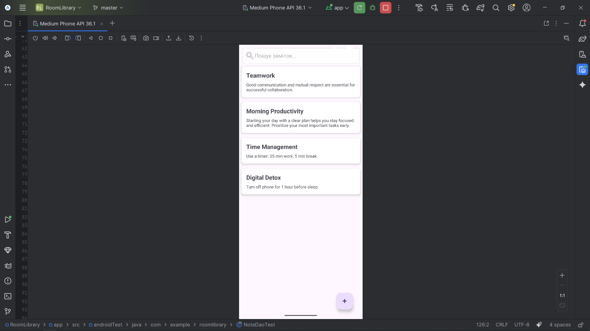

# RoomLibrary App

Простий та надійний Android-застосунок для керування замітками, що демонструє роботу з локальною базою даних з використанням бібліотеки **Room (2.6.1)**. 

## Технологічний стек
* **Мова:** Java
* **UI:** XML (Views)
* **Архітектура:** MVVM (Model-View-ViewModel)
* **Локальна БД:** Room Database
* **Асинхронність:** ExecutorService, LiveData
* **Тестування:** JUnit 4, AndroidX Core Testing

## Реалізовані сценарії
* **Сценарій A (Базовий):** Повноцінний CRUD (Створення, Читання, Оновлення, Видалення заміток). Видалення реалізовано за допомогою зручного жесту свайпу (Swipe-to-delete).
* **Сценарій B (Просунутий):** Повнотекстовий пошук у реальному часі та автоматичне сортування заміток за часом створення (нові зверху).
* **Сценарій C (Edge cases):** Додаток працює повністю в offline-режимі. Операції з БД винесені у фонові потоки (через `ExecutorService`), щоб уникнути ANR (Application Not Responding) при нестачі пам'яті.

## Тестування
Проєкт містить **5 In-Memory Unit-тестів**, що покривають бізнес-логіку застосунку та інтеграцію з Room (перевірка CRUD-операцій, пошуку та сортування).

## Інструкція зі встановлення
1. Клонуйте репозиторій: `git clone https://github.com/sheva64/RoomLibrary.git`
2. Відкрийте проект у Android Studio (Iguana або новіше).
3. Дочекайтеся завершення Gradle Sync.
4. Запустіть на емуляторі або реальному пристрої (min SDK 24).

## Архітектура рішення
Додаток побудовано за принципом **Separation of Concerns**:
1. `Entity` - Структура таблиці.
2. `DAO` - SQL-запити.
3. `Repository` - Єдине джерело істини для даних.
4. `ViewModel` - Підготовка даних для UI, стійкість до зміни конфігурації екрану.

*Скріншот працюючого додатку:* 

# RoomLibrary App
